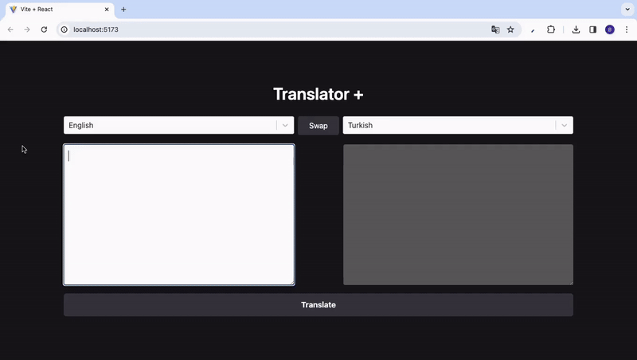

<h1>TRANSLATOR PLUS _redux-toolkit-thunk_</h1>

Introducing of Translator Plus: A translation tool crafted with Redux Toolkit and Thunk middleware. Boasting access to a vast array of languages—111 to be exact—courtesy of Rapid API integration, it provides a seamless translation experience. With its intuitive React-powered interface, users can effortlessly swap between languages and translate with precision.

<h2> Software Languages </h2>

- HTML

- CSS

- JavaScript

<h2> Libraries </h2>

- React

- Redux

- Redux Toolkit

- Redux Thunk

<h2> Development Tools </h2>

- Vite

<h2> Frameworks <h2>

- Tailwind CSS

<h2> Screen Gif </h2>

